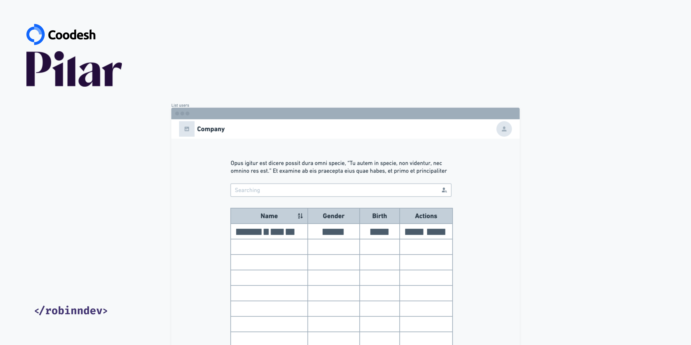

# Coodesh Case by Pilar

<div align="center">
   
</div>

<br/>
<br/>

Case de processo seletivo para [Pilar](https://www.linkedin.com/company/soupilar/)


### 📋 Pré-requisitos

Para começar a rodar a versão de dev, siga os comandos:

```
git clone https://github.com/robinndev/coodesh-case.git
```
Após isso

```
yarn Install
```
Ou

```
npm install
```

Caso tenha dúvidas consulte-me no [linkedin](https://www.linkedin.com/in/robinndev/)


## 🚀 Começando

Para rodar o projeto:

```
yarn serve
```
Ou

```
npm serve
```

## 📦 Funcionalidades

* **Listagem de usuários** ✅
* **Busca por nome** ✅
* **Busca por genêro** ✅
* **Abrir modal** ✅
* **Exibir informações detalhadas do paciente** ✅
* **Paginação** ✅
* **Passar página** ✅
* **Voltar página** ✅
* **Método para cortar a data e pegar apenas o necessário** ✅
<br/>
<br/>

**DIFERENCIAIS**

* **Diferencial 1 Adicionar um filtro por Gênero na tabela** ✅
* **Diferencial 2 Configurar o buscador para poder filtrar por nome e nacionalidade** ✅

* **Diferencial 3 Adicionar o paginador rota para facilitar compartilhar o link e manter a posição na lista** (Faltou terminar)

## 🛠️ Construído com

* [Vue 3](https://vuejs.org/) - O framework web usado
* [Vuex](https://vuex.vuejs.org) - Gerenciador de estados (store)
* [Yarn](https://www.npmjs.com/package/yarn) - Gerenciador de pacotes
* [Api](https://randomuser.me/api/) - Usada para gerar pacientes
* [Tailwind](https://tailwindcss.com/) - Framework CSS

## ⚠️ ATENÇÃO

ATENÇÃO!!! 
<br/>
<br/>
Por ser uma API da coodesh, creio que há muitos requests em cimas, as vezes quando se atualiza a página da um erro na API, verifiquei a resposta era um erro que aparentemente vinha do servidor, caso não venha a aparecer os dados, apenas atualize a página...
<br/>
<br/>
Ia colocar um alerta, mas como só consegui iniciar o projeto com um dia já de atraso, dei uma corridinha maior, pois no primeiro dia tive que prestar um tempo extra no projeto da empresa que trabalho!

## ✒️ Autor

* **Robson da Silva** - [Linkedin](https://www.linkedin.com/in/robinndev/)


## 🎁 Expressões de gratidão

* Adorei o projeto,desde já, agradeço pela oportunidade 📢
* Caso venha a dar certo, torço pra ver a equipe no happy hour, haha 🍺


---
⌨️ com ❤️ por [Robson](https://github.com/robinndev) 😊